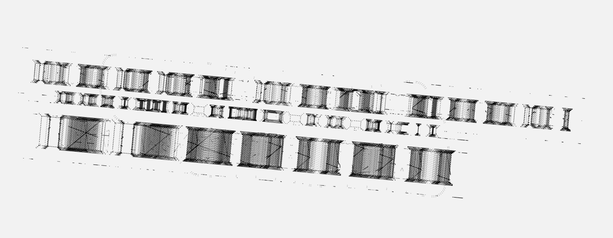

# motor_sounds
## 題目介紹
Жжжжжжжжжж, виииив, виииив, жжжжжжжж...
Zhzhzhzhzhzhzhzhzhzh, viiiiv, viiiiv, zzhzhzhzhzhzhzh ...
* file: motor(打開內容如下)
```
G0 F15000 X9 Y6 Z2
G1 F1500 E-6.5
G0 F4285.7 X66.444 Y105.4 Z0.27
G0 X66.988 Y105.085
G1 F1500 E0
G1 F1200 X71.075 Y103.179 E0.0668
G1 X75.944 Y100.629 E0.14822
G1 X80.618 Y97.832 E0.22891
G1 X85.152 Y94.758 E0.31005
G1 X88.268 Y92.43 E0.36767
G1 X88.716 Y92.146 E0.37553
...
```
## 思路
* 後來我們在網路上查到這是G code
* G code是一種描述點的移動的3D列印的code

## 程式實作
* 所以我們找到了3D列印的simulator online tool [ncviewer](https://ncviewer.com/)
* 然後就可以看到他印了三層東西
* 而flag就被夾在中間



* flag
kks{W3_c@N_1n_3D!}