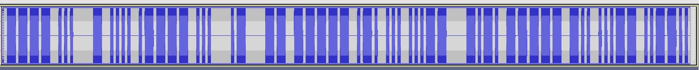
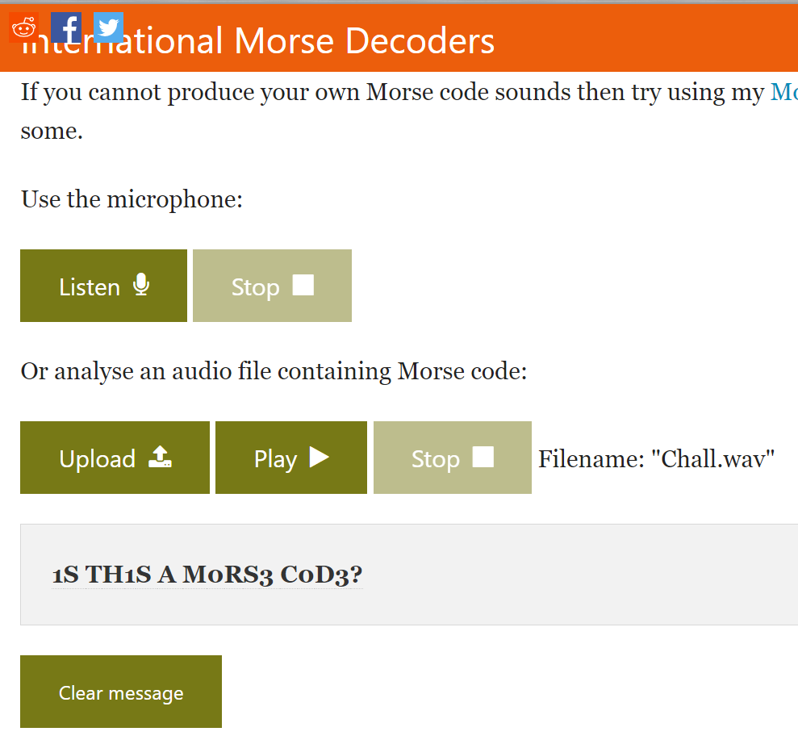

# Eaiest One
## 題目介紹
Listen the audio carefully.
flag format: cybergrabs{}
Author: nihal
* Chall.**wav**

## 思路
* 聽起來很摩斯
* 用Audacity打開觀察頻率
* 發現長短、間隔符合摩斯密碼規範
* 翻譯
* 得到flag

## 程式實作
* 用Audacity打開

* 翻譯

## 備註
* 後來看別人的writeup發現好用工具[International Morse Decoder](https://morsecode.world/international/decoder/audio-decoder-adaptive.html)，可直接把音檔翻譯
