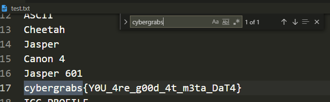

# Jasper
## 題目介紹
I like to play with image. Do you?
flag format: cybergrabs{}
Author: Nihal
* Jasper.**jpg**


## 思路
* 先跑strings加搜尋看看
  * 因為用windows沒有grep
* 然後就找到了

## 程式實作
* command
```
strings Jasper.jpg > test.txt
```
* open file, ctrl+F cybergrabs
* find flag
