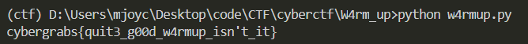

# W4rmUp
## 題目介紹
Welcome To TheCyberGrabs CTF Buddy :)
flag format: cybergrabs{}
Author: Odin
* w4rmup.**txt**


## 思路
* 替換成0和1看看
* 得到二進位數轉成ascii str
* 得到flag

## 程式實作
* code
```python
with open('w4rmup.txt', 'r') as f:
    c = f.read()

c = c.replace('@', '0').replace('$', '1')
c = int(c, 2)
c = c.to_bytes(c.bit_length() // 8 + 1, 'big')

print(c)
```
* flag
