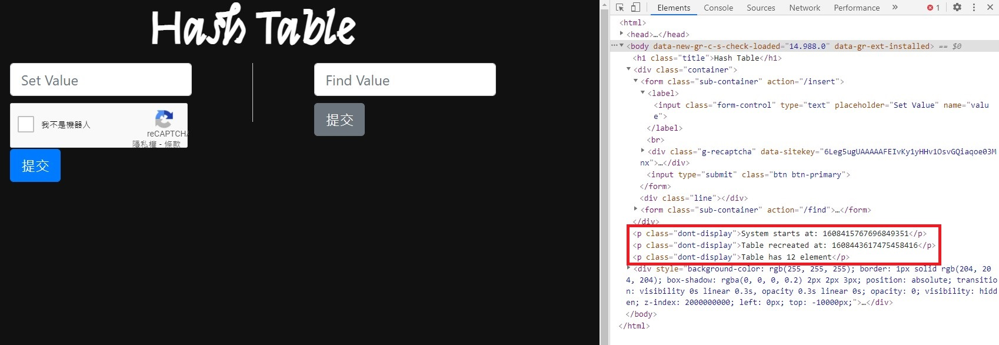

# Hashtable
## 題目介紹
Universal hashing could prevent hackers from DoSing the hash table by creating a lot of collisions. Shou doubt that. Prove him correct by DoSing this hash table implemented with universal hashing.

Note: having 10 collisions at the same slot would give you the flag
* main.go
* a link

## 思路
* 觀察main.go，找到hash function: $hash(v) = {p_1}^v\mod{(p_2)}\mod{(table\ size)}$

* 找到hash function參數之偽隨機產生方法

* 在網站找到seed

* 用[online go compiler](https://www.tutorialspoint.com/execute_golang_online.php)跑SRNG.go得到$p_1, p_2$

* 用hash.py暴力跑合法輸入範圍的所有解，隨便找一組挑10個輸入
  * 4096, 11274, 13121, 21908, 22646, 22963, 47830, 49854, 51909, 59665

* 得到flag

## code
* SRNG.go
```go
package main

import (
	"math/big"
	"math/rand"
	"fmt"
)

func main() {
   rand.Seed(1608443617475458416)//recreated time
   
   var p1 = big.NewInt(int64(rand.Intn(1 << 32)))
   var p2 = big.NewInt(int64(rand.Intn(1 << 32)))
   
   fmt.Print(p1, p2)
}
```
* hash.py
```python
if __name__ == "__main__":
    a = 3554082463# p1
    b = 3568539197# p2
    d = {}
    for x in range(4096, 1048577):
        h = pow(x, a, b) % 10000
        if not d.get(h):
            d[h] = [x]
        else:
            d[h].append(x)

    for x in d:
        if len(d[x]) >= 10:
            print(d[x])
```