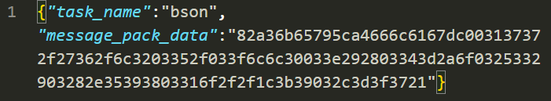
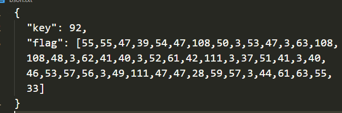
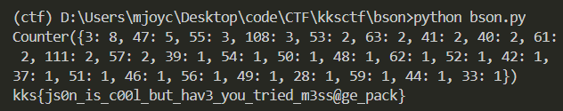

# bson
## 題目介紹
This is the last time i'm asking, who the f is bson??
* bson.**json**

## 思路
* 上網查bson發現是編碼後的json
* 試著用BSON to JSON conveter的線上工具轉，無果
* 後來查message_pack發現也是一種資料格式
* 用線上工具[messagepack-to-json](https://toolslick.com/conversion/data/messagepack-to-json)轉，得到又一個json

* 用頻率分析，發現各數字出現頻率差距懸殊，故推測是傳統加密
* 用bytewise xor嘗試後發現flag


## 程式實作
* 頻率分析與bytewise xor
```python
from collections import Counter

key = 92
flag = [55, 55, 47, 39, 54, 47, 108, 50, 3, 53, 47, 3, 63, 108, 108, 48, 3, 62, 41, 40, 3, 52, 61, 42,
        111, 3, 37, 51, 41, 3, 40, 46, 53, 57, 56, 3, 49, 111, 47, 47, 28, 59, 57, 3, 44, 61, 63, 55, 33]

# freq. analysis
print(Counter(flag))

# bytewise xor
flag = [(b ^ key).to_bytes(1, 'big') for b in flag]
flag = b''.join(flag)
flag = flag.decode('ascii')
print(flag)

```